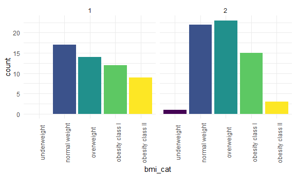

rk3110\_hw1
================
Rose Killian
1/22/2022

``` r
library(tidyverse)
```

    ## -- Attaching packages --------------------------------------- tidyverse 1.3.1 --

    ## v ggplot2 3.3.5     v purrr   0.3.4
    ## v tibble  3.1.4     v dplyr   1.0.7
    ## v tidyr   1.1.3     v stringr 1.4.0
    ## v readr   2.0.1     v forcats 0.5.1

    ## -- Conflicts ------------------------------------------ tidyverse_conflicts() --
    ## x dplyr::filter() masks stats::filter()
    ## x dplyr::lag()    masks stats::lag()

``` r
library(ggplot2)

knitr::opts_chunk$set(
  fig.width = 6,
  fig.asp = .6,
  out.width = "90%"
)

theme_set(theme_minimal() + theme(legend.position = "bottom"))

options(
  ggplot2.continuous.colour = "viridis",
  ggplot2.continuous.fill = "viridis"
)

scale_colour_discrete = scale_colour_viridis_d
scale_fill_discrete = scale_fill_viridis_d
```

## Read in .csv

``` r
hw1_df = 
  read_csv("data/bcdata_Assignment1.csv") %>% 
    janitor::clean_names()
```

    ## Rows: 116 Columns: 10

    ## -- Column specification --------------------------------------------------------
    ## Delimiter: ","
    ## dbl (10): Age, BMI, Glucose, Insulin, HOMA, Leptin, Adiponectin, Resistin, M...

    ## 
    ## i Use `spec()` to retrieve the full column specification for this data.
    ## i Specify the column types or set `show_col_types = FALSE` to quiet this message.

# Question 1

Table of quantitative features

# Question 2

Recode BMI

``` r
q2_df = 
  hw1_df %>% 
  mutate(
    bmi_cat = as_factor(case_when(
      bmi < 16.5 ~ "severely underweight",
      bmi < 18.5 ~ "underweight",
      bmi >= 18.5 & bmi <= 24.9 ~ "normal weight",
      bmi >= 25 & bmi <= 29.9 ~ "overweight",
      bmi >= 30 & bmi <= 34.9 ~ "obesity class I",
      bmi >= 35 & bmi <= 39.9 ~ "obesity class II",
      bmi >= 40 ~ "obesity class III"
    )
  ))

q2_df = 
  q2_df %>% 
  mutate(
    bmi_cat = 
      fct_relevel(bmi_cat,
                  "underweight",
                  "normal weight",
                  "overweight",
                  "obesity class I",
                  "obesity class II"))

#only 5 levels re-ordered as the sample does not contain observations for the lowest or highest BMI categories
```

# Question 3

Bar chart of proportion of breast cancer cases/controls within each BMI
category

``` r
q2_df %>% 
  ggplot(aes(x = bmi_cat)) +
  geom_bar(aes(fill = bmi_cat)) +
  facet_grid(. ~classification) +
  theme(axis.text.x = element_text(angle = 90), legend.position = "none")
```


